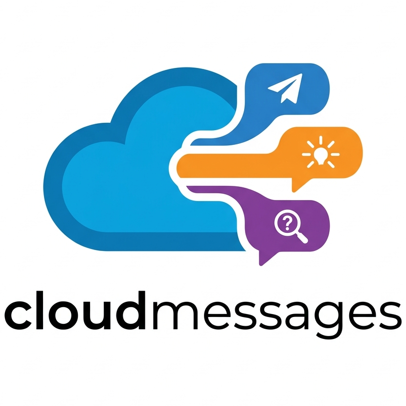

# CloudMessages

  

CloudMessages is a standards-oriented initiative for normalising major message types used in modern distributed systems.

- CloudEvents standardises facts.
- CloudCommands standardises intent.
- CloudQueries standardises information retrieval.

The project defines transport-agnostic envelopes and semantics for commands, queries, command responses, and query results. It is explicitly complementary to CloudEvents and is intended to improve interoperability, developer clarity, and end-to-end observability across message-oriented systems.

## Core repositories

- [spec](https://github.com/cloudmessages/spec)
- [site](https://github.com/cloudmessages/cloudmessages.github.io)
- [governance](https://github.com/cloudmessages/governance)
- [schemas](https://github.com/cloudmessages/schemas)
- [examples](https://github.com/cloudmessages/examples)

## Message taxonomy

| Message family | Meaning |
| --- | --- |
| Event | A past fact that already happened. |
| Command | A request to change state. |
| Query | A request to return data. |
| CommandResponse | The outcome of processing a command. |
| QueryResult | The outcome of processing a query. |

Commands and queries are aimed at a specific logical responder. Commands are conceptually point-to-point and queries must not change business state other than telemetry or similar technical concerns.

## Acknowledgements

CloudMessages builds on ideas that practitioners already use widely. The project gratefully acknowledges CloudEvents, Event Modelling, CQRS, and Domain-Driven Design.
